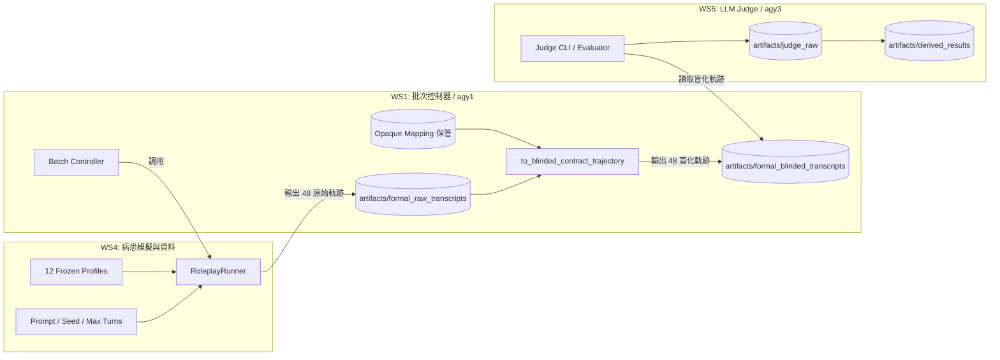

# Workstream 4 跨工作流驗收規格書（Cross-Workstream Acceptance Specification）

**版本**：v1.0 (STAGE 1: 規格定義與離線骨架驗證)  
**角色**：WS4（Patient Simulation / Data Provider，agy2）  
**範圍**：明確規範 WS4、WS1（Batch Controller，agy1）與 WS5（LLM Judge / Analysis，agy3）三方介面契約，防止數據污染與盲態洩漏。

---

## 1. 系統架構與職責劃分

---

## 2. agy1 Batch Controller 合約規範（WS1 交付標準）

### 2.1 執行規模與配對條件
- **軌跡總量**：嚴格維持 12 profiles × 4 conditions = **48 條軌跡**。
- **病患資料**：必須僅使用凍結之 12 位病患 profile（`SP-001` 至 `SP-012`），不得隨意抽換或增減。
- **配對隨機種子（Paired Seed）**：
  - 四個架構條件（A、B、C、D）在同一病患下必須統一使用 `FORMAL_SEED = 42`。
  - Talker、Planner 及 Patient Agent 均遵循此種子配對，確保比較效力符合受試者內設計（Within-Subject Pairing）。
- **輪數上限**：每條軌跡的最大對話輪次嚴格固定為 6 輪（`max_turns = 6`）。

### 2.2 執行隔離性（Isolation Contract）
- **Run 級別隔離**：
  - 每個 Run 擁有全域唯一之 `run_id`，格式範例：`WS4-FORMAL-<patient_id>-<condition>`。
- **User 級別隔離**：
  - 每個條件下的病患 `user_id` 必須獨立產生（例如：`ws4_<patient_id>_<condition>_formal`），嚴格與分析用之真實 `research_patient_id`（如 `SP-001`）解耦。
  - 禁止跨條件、跨回合共享對話記憶或 Session 快取。
- **State 目錄隔離**：
  - 每個 Run 必須在獨立的狀態目錄（`state_dir`）中執行（如 `<output_root>/<run_id>/isolated_state/`）。
  - 內部各自獨立寫入 `trajectories.jsonl`、`checkpoints/` 與 `logs/`，禁止任何 cross-condition state pollution。
- **行程隔離**：
  - 每一輪對話均透過獨立之子行程（Subprocess）執行 WS1 Harness，避免 Python 記憶體或全域狀態洩漏。

### 2.3 試跑隔離與防污染規則（Anti-Pollution Contract）
- **實體路徑分離**：
  - Pilot 試跑產物根目錄：`llm_ablation_paper/artifacts/pilot/`（或 `workstream_4_patient_simulation/artifacts/formal_pilot/`）。
  - Formal 正式原始產物根目錄：`llm_ablation_paper/artifacts/formal_raw_transcripts/`。
  - Formal 正式盲化產物根目錄：`llm_ablation_paper/artifacts/formal_blinded_transcripts/`。
- **命名識別**：
  - Pilot 產物之 `run_id` 必須包含 `PILOT`，`summary.json` 必須標記 `"twelve_by_four_started": false`。
  - 正式批次控制器必須封鎖任何包含 `pilot` 標記或路徑的資料混入。

### 2.4 中斷與續跑合約（Checkpoint / Resume Contract）
- **原子檢查點（Atomic Checkpoint）**：
  - 每一輪子行程落盤成功後，Runner 必須將當前進度原子性寫入 `ws4_runner_checkpoint.json`。
- **安全續跑**：
  - 若遇暫態錯誤中斷，傳入 `resume=True` 時必須從上一輪已確認儲存之 checkpoint 接續執行，禁止重複呼叫已完成之對話輪次。

### 2.5 完整性檢驗與盲化合約（Blinding & Sanitization Contract）
- **不完整軌跡拒絕**：
  - 若軌跡未達到合法終止條件（`MAX_TURNS`、`PATIENT_GOAL_MET`、`COMMON_INPUT_BLOCK`、`ERROR`）或輪次資料殘缺，禁止輸出至成功清單，且**拒絕**轉出盲化契約。
- **Raw → Blind 無洩漏轉換**：
  - 必須呼叫 WS1 的 `to_blinded_contract_trajectory` 進行盲化。
  - Mapping 保管：Opaque condition mapping 僅由 WS1 持有並妥善保存在 `artifacts/frozen_config/`。
  - 遮蔽原則：
    - `run_id` 雜湊轉換為 `BLIND-<hash>`。
    - `state_dir_id` 轉換為 `STATE-BLIND-<hash>`。
    - 替換真實條件名稱，以 `condition_secret`（opaque hex ID）呈現。
    - 物理剝除所有敏感鍵值（`enable_*`、`condition`、`mapping`、`planner_model` 等）。

---

## 3. agy3 CLI Input/Output 合約規範（WS5 評分介面標準）

### 3.1 Input Contract（評分輸入契約）
- **輸入來源**：
  - WS5 評分 CLI 僅接收來自正式盲化目錄（`artifacts/formal_blinded_transcripts/`）之產物。
- **資料規模完整性**：
  - 必須嚴格包含恰好 48 份合約完整的盲化軌跡檔案。
  - 12 位病患（`SP-001` ~ `SP-012`），每位病患必須對應恰好 4 個不同的 `condition_secret`，無缺件、無重複。
- **Fail-Closed 門禁檢核規則**：
  1. **拒絕 Pilot 數據**：若檔案路徑、檔案名或 JSON 內容含有 `PILOT` 或 `pilot`，立即中斷退出並報錯。
  2. **拒絕 Canary 數據**：若 `patient_id` 為 `SP-CANARY-*` 或含 `canary` 標記，立即拒絕載入，不得計入正式評分。
  3. **拒絕敏感洩漏**：若資料中包含明文條件識別（例如包含鍵名 `condition`、值為 `"A"`、`"B"`、`"C"`、`"D"`）或包含內部旗標（`enable_planner` 等），立即失敗退出。
  4. **拒絕結構殘缺**：軌跡必須具備 `patient_id`、`condition_secret`、`records`（非空），且 records 包含完整之使用者與助手對話。

### 3.2 Output Contract（評分與分析輸出契約）
- **評分原始紀錄（Judge Raw Output）**：
  - 輸出目錄：`llm_ablation_paper/artifacts/judge_raw/`。
  - 內容：48 份對話的逐輪與總結評分，包含安全性、醫學事實正確性、衛教指南遵從度等各項 Rubric 指標數值與理由。
  - 元資料：記錄評審模型資訊（凍結為 `gemini-3.7-flash`，`temperature = 0.0`）。
- **分析與統計報表（Derived Results）**：
  - 輸出目錄：`llm_ablation_paper/artifacts/derived_results/`。
  - 統計方法：包含 ANOVA、成對檢定（Paired t-test / Wilcoxon signed-rank test）。
  - **解盲前狀態**：所有圖表與報表一律以 opaque ID（如 `COND-xxx`）進行組別標示，嚴禁臆測或反推真實 A/B/C/D。
  - **解盲作業**：僅在 WS1 正式提供經簽核的解盲 mapping 檔案後，方可執行最後一步映射轉換並輸出最終論文表格。

---

## 4. STAGE 1 驗證成果（Fake-Only 測試骨架）

在 STAGE 1 階段，WS4 於 `workstream_4_patient_simulation/tests/test_cross_workstream_acceptance.py` 建立完整的離線合約驗證測試：
1. **WS4 隔離合約驗證**：驗證跨條件產生的 `user_id`、`state_dir` 與 `run_id` 互斥且獨立。
2. **WS4 檢查點與續跑驗證**：驗證中斷後以 `resume=True` 能正確接續，輪次無縫且結構合規。
3. **四種終止理由合規驗證**：驗證 `MAX_TURNS`、`PATIENT_GOAL_MET`、`COMMON_INPUT_BLOCK` 與 `ERROR` 之觸發與紀錄。
4. **盲化軌跡合約驗證**：以虛擬 Mapping 驗證 `to_blinded_contract_trajectory` 之敏感欄位物理剝除與遮蔽。
5. **agy1 / agy3 防禦性檢驗邏輯測試**：驗證批次規模、種子一致性、Pilot 拒絕、Canary 拒絕與洩漏攔截邏輯。

---

## 5. STAGE 2 待辦事項清單（Cross-Workstream Fake E2E）

待專案主持人（PM）通知 `main` 分支已合併 agy1（Batch Controller）與 agy3（Judge CLI）之程式後，WS4 將執行下列任務：
- [ ] 執行 `git pull origin main` 更新至最新程式庫。
- [ ] 將 `test_cross_workstream_acceptance.py` 中的 STAGE 2 placeholder 升級為端到端呼叫：
  - 串接 agy1 的批次控制器 fake 模式，產生 48 條原始軌跡並輸出盲化軌跡。
  - 串接 agy3 的評分 CLI fake 模式，讀取 48 條盲化軌跡並產生盲態分析報告。
- [ ] 確認端到端 fake 驗收測試全數通過（不呼叫任何付費 API）。
- [ ] 提交 PR 交付 PM 審核與合併。
