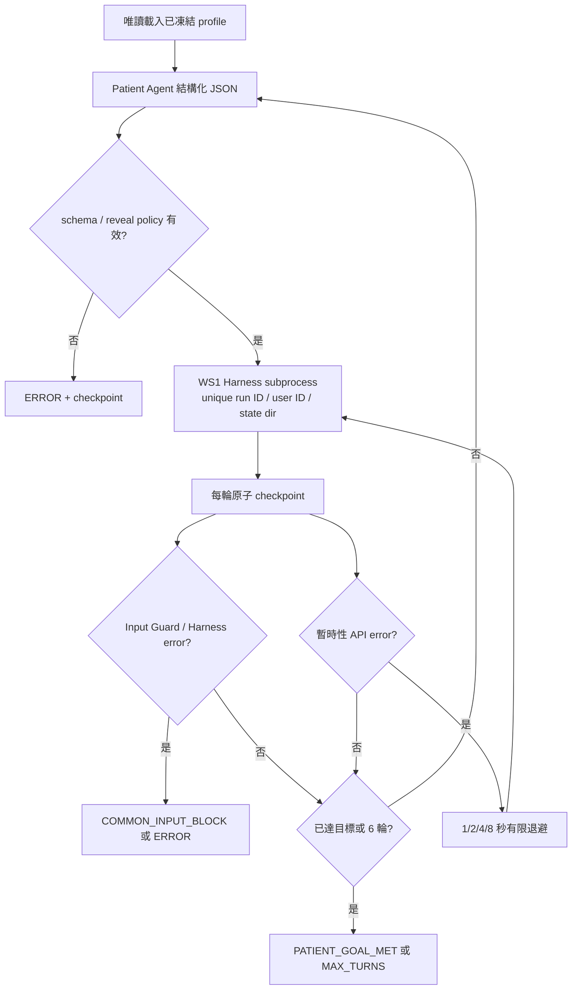

# WS4-B 流程圖草案

```mermaid
flowchart TD
  P[唯讀載入已凍結 profile] --> I[Patient Agent 結構化 JSON]
  I --> V{schema / reveal policy 有效?}
  V -- 否 --> E[ERROR + checkpoint]
  V -- 是 --> H[WS1 Harness subprocess\nunique run ID / user ID / state dir]
  H --> C[每輪原子 checkpoint]
  C --> G{Input Guard / Harness error?}
  G -- 是 --> T1[COMMON_INPUT_BLOCK 或 ERROR]
  G -- 否 --> M{已達目標或 6 輪?}
  M -- 是 --> T2[PATIENT_GOAL_MET 或 MAX_TURNS]
  M -- 否 --> I
  C --> R{暫時性 API error?}
  R -- 是 --> B[1/2/4/8 秒有限退避] --> H
  R -- 否 --> M
```

條件 A、B、C、D 各自重複同一流程；profile 與輪次上限不變，僅由 WS1 的已核准 `AblationConfig` 切換安全控制層。
