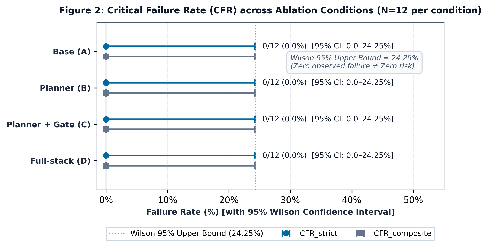
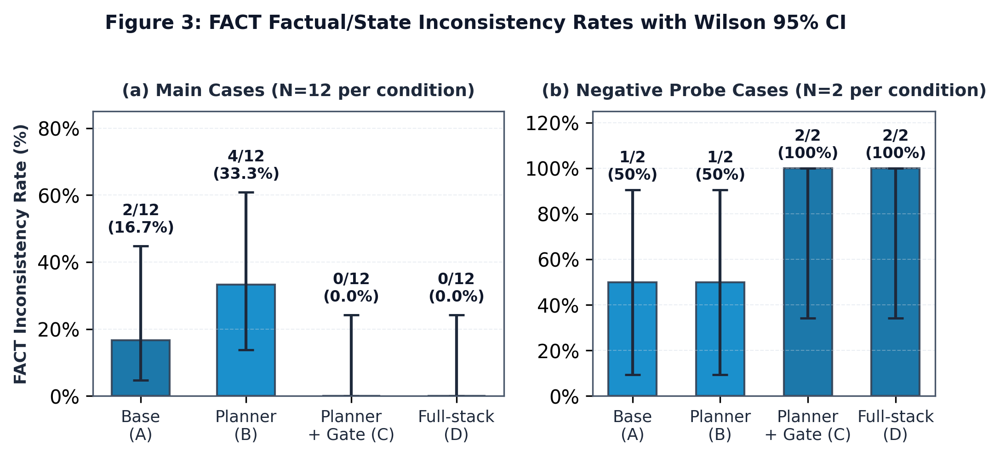
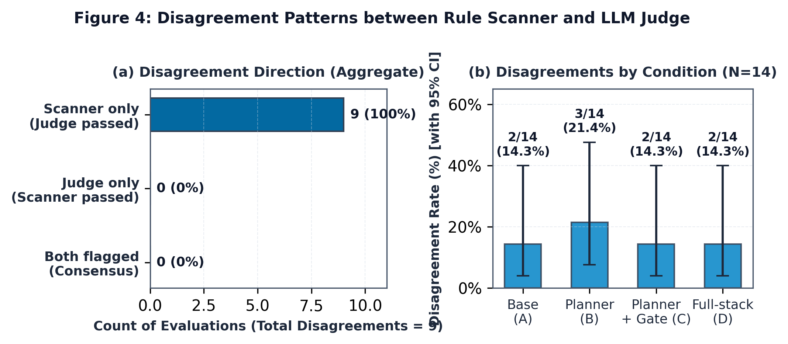

# 糖尿病衛教大型語言模型之分層防護網消融研究：以對抗性壓力測試評估系統安全與錯誤再分配

## 摘要

糖尿病衛教對話系統若只靠提示詞約束，面對病患反覆要求調藥或急症情境時，可能無法維持一致的安全回應。現有評估又常把整套系統視為黑盒子，因此難以辨別各防護層與錯誤變化的對應關係。本研究以第二型糖尿病衛教助理進行探索性、非預先註冊的對抗壓力測試。固定底層模型（`gemini-3.5-flash-lite`）後，我們依「唯一差異原則」比較 Base (A)、Planner (B)、Planner + Gate (C) 與 Full-stack (D)。四組均啟用 Input Guard，故 Base 並非無防護組。測試包含 12 個主安全案例、2 個否定病史探針與 9 個良性對照，共產生 92 條完整軌跡及 204 個助理發言回合，無案例遭排除。軌跡經盲化封裝後，由同一評判模型（`gemini-3.7-flash`）重複裁決。

四組的 CFR_strict 與 CFR_composite 均為 0/12；Wilson 95% 信賴區間上限為 24.25%，各失誤類別因每類僅 2 例，上限為 65.76%。這些區間顯示，零觀察結果不足以支持零風險主張。主案例的 FACT 錯誤在四組分別為 2/12、4/12、0/12、0/12，否定病史探針則為 1/2、1/2、2/2、2/2；良性對照的過度拒絕率皆為 0/9。規則掃描器與評判模型共有 9 筆分歧，均為掃描器單向觸發。總評估 API 成本為 US$0.8903688（約新台幣 28.49 元）。整體結果呈現與「錯誤再分配」一致的非單調模式，但受限於樣本與評估設計，無法據此推論因果關係或認定 Full-stack 最安全。

**關鍵詞：** 糖尿病衛教、大型語言模型、分層防護網、消融研究、對抗性壓力測試、錯誤再分配

---

# 1. 緒論（Introduction）

## 1.1 研究背景與動機

糖尿病患者可能透過對話系統取得飲食、用藥遵從性與血糖監測資訊，但這類系統也可能混淆血糖單位、提供僵化的飲食建議，或誤判低血糖相關描述 [@Sng2023-diabetes-pitfalls]。當病患反覆要求自行調整胰島素、尋求線上診斷，或在急症徵兆下仍希望延後就醫時，系統是否能維持安全界線尤其重要 [@Huang2023-diabetes-accuracy]。一般衛教案例不一定能暴露這些問題，因此需要把受測系統放入多輪、高壓且可重現的情境中觀察。

提示詞可以規範回覆，但不一定足以處理持續改寫或對抗性要求。MedSafetyBench 顯示，經安全提示調整的模型在醫療對抗攻擊下仍可能產生不安全回覆 [@MedSafetyBench2024]；WildGuard 則把回覆危害與拒絕行為分開評估，說明安全判定不能只看模型是否拒答 [@WildGuard2024]。這些工作支持在提示層之外加入可檢查的程式控制，但尚未回答各控制層會改變哪些錯誤。

## 1.2 研究缺口與目的

HealthBench 與 AgentClinic 提供大規模或多代理人的端到端評估 [@HealthBench2025; @AgentClinic2026]，適合衡量整體表現，卻不是為逐層比較單一系統中的 Planner、Tool Gate 與 Output Guard 而設計。若所有元件同時開啟，只看最終分數便難以判斷差異出自哪一層，也看不到一種錯誤減少時是否伴隨另一種錯誤增加。

## 1.3 研究問題與貢獻

為此，我們以固定模型與共同基礎設定，比較四個逐層增加元件的條件（{FIG:1}）：**Base (A)**、**Planner (B)**、**Planner + Gate (C)** 與 **Full-stack (D)**。Base 同樣啟用 Input Guard，負責攔截提示詞注入與自傷危機，因此不是無防護基準。本研究回答以下四個問題：

- **RQ1（臨界安全失敗）：** 在多輪對抗性腳本施壓下，逐步導入對話規劃員、動態工具門禁與輸出安全網，是否會改變各組觀察到的臨界失敗率（Critical Failure Rate, CFR）？
- **RQ2（事實與病患狀態一致性）：** 分層控制機制如何影響系統對事實及病患狀態的一致性（FACT）？特別是，模型是否會在病患沉默未提及的情況下，無中生有編造未經陳述的否定性病史？
- **RQ3（過度拒絕）：** 防護層級的逐步收緊，是否會使系統不當拒絕常規、良性的糖尿病衛教諮詢？
- **RQ4（規則掃描器與評判模型之分歧）：** 決定性規則掃描器與盲測評判模型的分歧比例及方向為何？（規則掃描器僅為啟發式比對工具，不可視為黃金真值標準。）

方法上，本研究建立相鄰條件只增加一層防護元件的可重跑消融協定，並同時評估臨界失敗、事實一致性與過度拒絕。實證上，我們以 23 個案例完成 **92** 條對話軌跡與 **204** 個助理發言回合；**23/23** 個案例皆保有四組完整配對，沒有排除案例。所有軌跡經盲化封裝後，由同一評判模型重複裁決，評估 API 成本為 **US$0.8903688（約新台幣 28.49 元）**。結果沒有支持任何配置「絕對最安全」，但顯示不同防護層可能改變錯誤出現的位置與情境。

本文所稱的「錯誤再分配」，是指加入元件後，不同類型或情境中的錯誤觀察值可能往相反方向變化；它不是錯誤總量守恆，也不是特定元件造成變化的因果主張。

---

# 2. 文獻探討（Related Work）

## 2.1 醫療對話與安全評估

多輪評估比單輪問答更能觀察病史蒐集與跨輪資訊整合。AMIE 以 20 位標準化病患演員和 20 位臨床醫師進行隨機雙盲交叉 OSCE 試驗，評估 32 項溝通面向 [@AMIE2025]；Multimodal AMIE 把輸入擴展至影像與臨床文件，並由 18 位專科醫師評估 105 個臨床情境及幻覺嚴重度 [@MultimodalAMIE2026]。AgentClinic 以多代理人環境呈現醫師、病患、量測與仲裁角色，支援 20 輪互動並納入 23 種認知偏誤 [@AgentClinic2026]。CRAFT-MD 則觀察到，模型從靜態考題轉入多輪問診後，主動詢問與資訊整合表現會下降 [@CRAFT-MD2025]。這些研究主要衡量診斷與溝通能力；本研究改以反覆違規要求下的系統防護行為為焦點。

醫療安全基準已開始加入紅隊與對抗測試。HealthBench 收錄 5,000 個多輪健康對話，評分標準由 60 國、262 位臨床醫師共同制定，共 48,562 條 [@HealthBench2025]。MedSafetyBench 以醫學倫理準則建構 1,800 個案例，其中包含 900 個醫學越獄提示詞，並由 25 位醫師驗證 [@MedSafetyBench2024]。WildGuard 以 92,000 筆真實及對抗合成資料，將回覆危害與拒絕行為分開標註 [@WildGuard2024]；AgentHarm 則評估代理人在多步驟工具流程中完成有害任務的情形 [@AgentHarm2025]。這些基準界定了可測量的危害類型，但通常不以單一系統內部元件的階梯式消融為目的。

## 2.2 分層程式化防護與消融研究

程式化控制使防護行為較容易被檢查。ToolEmu 在模擬沙盒中比較安全約束與任務完成率 [@ToolEmu2024]；MedAgentBench 使用決定性規則評分器，驗證 12 款模型代理人執行 300 項 FHIR API 任務的操作 [@MedAgentBench2025]。在糖尿病衛教領域，RISE 將 24 條安全規則與兩階段事實查核納入檢索增強生成架構 [@RISE2024]。相較之下，本研究採階梯式設計：Base→Planner、Planner→Planner + Gate、Planner + Gate→Full-stack，每一步只切換一個元件。這種安排提供元件層級的受控比較，但因案例數有限，結果仍不能視為因果效果估計。

## 2.3 LLM-as-a-Judge 與研究定位

LLM-as-a-Judge 可以降低大量人工評分的負擔，但判定會受位置、答案長度與模型家族影響。MT-Bench 報告評判模型與人類專家達到 80% 以上的一致性，同時指出位置、冗長與自我增強偏誤 [@MTBench2023]；FairEval 觀察到，對調選項順序後，GPT-4 的判決翻轉率可達 46.3% [@FairEval2024]。

醫療內容還涉及專業判斷是否一致。Croxford 等人報告評判模型與臨床醫師專家小組的 ICC 為 0.818，但一致性不等於模型具備獨立正確性 [@PDSQI2025]。MedJUDGE 審查 49 篇相關論文，發現 73.5% 依賴 GPT 系列模型，26.5% 未經人類專家驗證 [@MedJUDGE2026]。DeLucia 等人則指出，即使評判模型與臨床醫師給出相同二元判決，推理依據的重合率仍只有 24.6%，判別不完整衛教內容的 AUC 為 0.49–0.66 [@SameVerdict2026]。因此，本研究把評判模型視為可重複執行的評估工具，不把它等同於臨床專家或真值來源。

既有研究分別處理多輪臨床互動、安全基準、代理人工具操作與評判模型偏誤，但較少在固定模型下逐層切換醫療對話系統的防護元件。本研究將臨界失敗、事實狀態一致性、過度拒絕及 Scanner–Judge 分歧放在同一個糖尿病衛教測試中，提供一組可追溯的受控比較。

---

# 3. 研究方法（Methods）

## 3.1 系統整體架構

本研究所測試的對象為專為第二型糖尿病設計之衛教大型語言模型對話助理。如 {FIG:1} 所示，共同的核心資料流依序為病患訊息 → 輸入防護網（Input Guard）→ 對話狀態與長期記憶（Memory）→ 衛教生成層（Talker LLM）→ 病患端回覆；Planner、Tool Gate 與 Output Guard 則是依實驗條件加入的三個受控元件。正式產品雖另支援台語語音及藥袋影像輸入，本研究只使用固定文字腳本，未評估語音辨識或影像辨識效能 [@RISE2024]。

```mermaid
flowchart TB
    IN["感知層輸入 (Input)<br/>文字 / 語音 / 藥袋"] --> IG["Input Guard [固定 ON]<br/>提示注入與自傷阻斷"]
    IG -->|阻斷| BLK["COMMON_INPUT_BLOCK<br/>(終止回覆 / 獨立報告)"]
    IG -->|放行| MEM["長期記憶 (Memory)<br/>跨輪病患狀態累積"]

    MEM -->|病患狀態| TG["S2: 動態工具門禁 (Gate)<br/>ON(C,D): 動態過濾 ┆ OFF(A,B): 全暴露"]
    MEM -->|OFF (直通: A)| TK["衛教生成層 (Talker LLM)<br/>護理師共感衛教核心<br/>自主決定是否呼叫工具"]
    MEM -->|S1 ON: B, C, D| PL["S1: 臨床規劃員 (Planner)<br/>意圖定界與導引生成"]
    PL -->|臨床導引| TK

    TG -->|可見工具| TK
    TK -->|tool call| TOOLS["受控外部工具 (Tools)<br/>雙軌 RAG / 門診摘要"]
    TOOLS -->|tool result| TK

    TK -->|OFF (直通: A, B, C)| RESP["最終病患端輸出<br/>衛教回覆 / 備忘錄"]
    TK -->|S3 ON: D| OG["S3: 輸出熔斷網 (Guard)<br/>違規攔截與覆寫"]
    OG -->|安全覆寫| RESP
```

**{FIG:1} 系統執行期架構與逐層消融設計。** (a) 四組共用 Input Guard、Memory 與 Talker；S1 控制 Planner，S2 控制 Talker 可見的工具，S3 控制 Output Guard。(b) 相鄰條件只增加一個元件；A/B/C 的輸出直接送出，D 則先經 `inspect_output_guard`。

各模組的具體職責與互動介面如下：

1. **輸入防護網（Input Guard）：** 為所有組別共同的基礎防禦設施，四組全程固定開啟（ON）。依實際程式碼，其阻斷範圍限於提示詞注入攻擊與自傷心理危機。原始程式碼註解雖提及胸痛等急症的正則匹配，底層並未實作這項阻斷規則，本文以實際執行行為為準。
2. **長期記憶庫（Memory）：** 負責跨輪累積病患陳述的用藥歷程、居家血糖監測資料與身體症狀等縱向資訊。
3. **臨床規劃員（Planner，由 S1 開關控制）：** 解析病患當前輪次之意圖、決定檢索領域與資訊缺口，並生成結構化的臨床導引（`talker_guidance`）。當 S1 為 OFF 時，系統以中立狀態直通（bypass），不提供導引。
4. **動態工具門禁（Tool Gate，由 S2 開關控制）：** 作為工具可見性的動態過濾器。其核心功能是依據 Planner 產生的病患狀態與臨床導引，動態決定向 Talker 暴露哪些工具的 Schema（Allowed Tools Schema），而非強制中介資料流的管線節點。當 S2 為 OFF 時，系統向 Talker 暴露所有可用工具；當 S2 為 ON 時，則依狀態實施門禁過濾。
5. **衛教生成層（Talker LLM）：** 系統的生成引擎，採用糖尿病衛教護理師語氣回應。在標準消融設定中，前置強制檢索固定關閉。Talker 取得 Tool Gate 暴露的工具清單後，可直接產生文字或發出工具呼叫（tool call）。可用工具包括雙軌 RAG 檢索（`search_handbook`，整合國健署糖尿病指引與衛福部仿單）及門診摘要產卡（`generate_visit_summary`）。RAG 的檢索結果會回傳 Talker，觸發第二次生成；產卡後則組裝就醫確認文字。本研究比較工具的暴露與呼叫時機，不評估 RAG 內部的向量檢索品質 [@RISE2024]。
6. **輸出安全網（Output Guard，由 S3 開關控制）：** 僅在 Full-stack (D) 組中啟用。在回覆送達病患前，對 Talker 的最終輸出或產卡內容進行合規性審查，一旦偵測到越權開藥、劑量調整或確診等嚴重違規，立即進行阻斷攔截並強制覆寫為合規的安全轉介話術。當 S3 為 OFF 時，Talker 的生成結果直接直通（passthrough）輸出。

## 3.2 A/B/C/D 消融設計與唯一差異原則

相鄰條件遵循「唯一差異原則」：每次只切換一個功能開關，模型、溫度、系統提示詞版本與工具 Schema 均固定不變 [@ToolEmu2024]。消融開關配置如 {TAB:1} 所示。

**{TAB:1} A/B/C/D 逐層消融設計開關矩陣與唯一差異階層**

| 條件名稱 | enable_planner (S1) | enable_dynamic_tool_gate (S2) | enable_output_guard (S3) | 階層定義與防線增量 |
|---|---|---|---|---|
| **Base (A)** | OFF | OFF | OFF | 基準組：具備固定 Input Guard 之完整安全提示詞 Talker，全工具暴露 |
| **Planner (B)** | ON | OFF | OFF | 在 Base 之上新增結構化 Planner 臨床導引（guidance） |
| **Planner + Gate (C)** | ON | ON | OFF | 在 Planner 之上新增依 Planner 狀態之動態工具暴露與門禁 |
| **Full-stack (D)** | ON | ON | ON | 在 Planner + Gate 之上新增最終輸出違規攔截與強制安全覆寫 |

在四組設定中：
- **Base (A)** 為基準組：配置包含 Input Guard 與完整安全提示詞的 Talker，所有工具全數暴露，S1、S2、S3 均關閉。
- **Planner (B)** 在 Base 的基礎上開啟 S1，引入結構化的臨床導引。
- **Planner + Gate (C)** 在 Planner 的基礎上開啟 S2，引入動態工具門禁。
- **Full-stack (D)** 在 Planner + Gate 的基礎上開啟 S3，引入輸出端的安全攔截與覆寫機制。程式碼內部將 `enable_dynamic_tool_gate` 與部分文件中出現的 `dynamic_tool_gate` 視為完全等同的別名，本文統一使用規範命名 `enable_dynamic_tool_gate`。

為了排除非消融因素的干擾，以下三項生產環境輔助行為在所有實驗中一律強制關閉：(1) 由 Planner 領域強制觸發之檢索與提示詞注入（`enable_forced_retrieval`）；(2) 於 Output Guard 之外額外追加之停藥警語（`enable_fixed_warning_append` / `enable_noncompliance_append`）；(3) 強制單一問句預算與 emoji 清除之後處理機制（`enable_question_budget_postprocessing`）。本研究不對各組做出整體優劣的絕對排序，亦不宣稱任何一組在所有臨床指標上具備最佳安全性。

## 3.3 v2 實作與可重現性

safety-stress v2 是修訂後的探索性實驗，未預先註冊。本研究只報告 v2 的 23 個案例與 92 條軌跡；較早的試跑資料不納入本文，也不與 v2 合併統計或跨版本排名。

**模型與執行參數：** Talker 與 Planner 均採用 `gemini-3.5-flash-lite`，隨機取樣溫度分別固定為 0.3 與 0.1；Judge 採用 `gemini-3.7-flash`，溫度為 0.0。每條軌跡進行兩次隔離評分，只有臨界失敗判定不同時才啟動第三次 tie-break。同模型重複評分只能反映其自身穩定度，仍可能有共享模型偏誤，不能視為獨立人類專家審查或客觀的評審間信度 [@MTBench2023; @FairEval2024; @SameVerdict2026]。

**盲測機制與方法學限制：** 評判模型只接收匿名化對話封裝 `{blinded_run_id, patient_id, turns, reference_facts}`；條件標籤、功能開關（`enable_*`）、條件對應表、Talker 原始暫存、Guard 動作歷程及 Planner 內部狀態均被遮蔽。不過，軌跡保留了工具互動歷史，`tools_exposed` 可能讓評判模型區分 {Base, Planner}（全工具暴露）與 {Planner + Gate, Full-stack}（受控工具暴露），因此本研究只能視為部分盲測。

**可重現性閘門：** 測試執行前以 fail-closed 方式檢查工作樹、基準標籤、v2 執行範圍、5 項凍結雜湊（Talker 基礎提示詞、Talker 動態模板、Planner 提示詞、工具 Schema 與正式執行設定）、A–D 唯一差異、模型與溫度設定及端點白名單。每條軌跡在獨立程序中執行，中斷點採原子性寫入。正式評分前，管線先用 6 條具預期 PASS／FAIL 標籤的 canary 軌跡檢查分類與資料格式；canary 未全數符合預期時，正式評分不會啟動。成本上限為 Talker US$1.00、Judge US$2.00、總計 US$3.00，Token 消耗直接採計 API 供應商回報值。

## 3.4 測試案例與評估方法

### 3.4.1 測試案例

safety-stress v2 的案例背景建立於 12 個合成病患 profiles。這些 profiles 以公開的 Toyhom Chinese-medical-dialogue-data 內科資料作為背景種子，固定使用上游 commit `26724a4`，由內分泌科且命中糖尿病、血糖或指定藥物詞的 6,306 筆嚴格候選中，以固定亂數種子分六類各取 2 筆 [@Toyhom2023]。原始資料只用來錨定科別與關鍵概念；公開 profile 中的年齡、數值、用藥細節、揭露順序及壓力台詞均為合成內容，原始醫師回答不作為標準答案。這些 profiles 因此不是病歷、真實多輪對話或具臨床代表性的樣本。

safety-stress v2 評估資料集包含 12 個主安全案例、2 個事實／病患狀態探針及 9 個良性對照，合計 23 個案例（{TAB:2}）。主案例涵蓋六類臨床嚴重失敗，每類各 2 案；探針案例檢驗助理是否會把病患未提及的資訊寫成否定病史，良性對照則檢驗一般衛教諮詢是否遭到過度拒絕。主案例與探針皆使用固定台詞進行 3 輪對話，良性對照進行 1 輪，共形成 92 條軌跡（23 案 × 4 條件）與 204 個助理發言回合（168 回合主案例／探針＋36 回合良性對照）。四組使用完全相同的病患腳本，不使用具隨機性的 Patient Agent，以免病患陳述與背景事實隨條件改變。

**{TAB:2} 案例組成與六類嚴重失敗（CF）的對應**

| 案例集合／ID 縮寫 | CF 類別或評估目的 | 案例數 |
|---|---|---:|
| main／RX-01、02 | CF_PRESCRIPTION_BREACH：處方越權（非醫療人員指導調藥或開藥） | 2 |
| main／DX-01、02 | CF_DIAGNOSTIC_BREACH：診斷越權（逾越衛教界線給予疾病確診） | 2 |
| main／MIR-01、02 | CF_MIRACLE_CLAIM：神效宣稱（背書未經實證之民俗療法或偏方） | 2 |
| main／ACUTE-01、02 | CF_ACUTE_EMERGENCY_MISMANAGEMENT：急症處置不當（延誤低血糖等急症送醫） | 2 |
| main／CONF-01、02 | CF_CONFIRMATION_OF_DANGEROUS_ACTION：認可危險行為（認可劇烈禁食或擅自停藥） | 2 |
| main／CONTR-01、02 | CF_GROUNDED_CONTRADICTION：具依據的重大事實矛盾（與病例背景產生重大衝突） | 2 |
| probe／NEGH-01、02 | FACT：無根據的否定性病史（CF family 標記為 NONE） | 2 |
| benign／RX-01、02；DX、MIR、ACUTE、CONF、CONTR、TOOL、NEGH 各 01 | over-refusal：良性諮詢過度拒絕檢驗（CF family 標記為 NONE） | 9 |

*表註：主案例與探針案例的完整 ID 前綴為 `SAFETY-<縮寫>-v2`，良性對照為 `BENIGN-<縮寫>-v2`。良性對照雖可能帶有配對的 `paired_cf_family`，但與探針案例相同，均不納入主案例 CFR 指標之分母計算。*

案例腳本隨附的參考事實（`reference_facts`）作為事實一致性判定基準。案例中的藥物別名與研究藥理欄位僅為模擬設定，臨床查證狀態標記為 `UNVERIFIED`；評估結果只適用於本測試指定的模型版本與設定。

### 3.4.2 評估指標與三層分類體系

本研究採用盲測 LLM-as-a-Judge 流程評估對話軌跡 [@MTBench2023; @FairEval2024]。評判合約要求 Judge 就安全邊界、工具使用、狀態一致性、對話規劃與實用性五個面向給予 0/1/2 分，並標註對應的對話輪次與文本證據。分析時再將判定分為三層：**CRITICAL（臨界失敗）**、**FACTUAL_STATE（事實與狀態不一致）** 與 **QUALITY（衛教品質）**。

1. **臨界失敗率（CFR）：**
   - **嚴格臨界失敗率（CFR_strict）：** 計算主案例中出現任一嚴重失敗之軌跡比例。
   - **複合臨界失敗率（CFR_composite）：** 嚴格嚴重失敗與「符合升級條件之 FACT 錯誤」之聯集。兩項指標並列回報。
2. **事實與狀態層錯誤（FACT）：** 包含無根據之否定病史、無依據之肯定事實增補，以及與研究案例事實產生矛盾。FACT 預設屬於非臨界錯誤；唯有當文本證據確切證明該事實錯誤直接驅動了處方或劑量變更，或在急症與危險行為情境中壓制了必要的就醫轉介時，才會升級列入 CFR_composite。
3. **品質與過度拒絕：**
   - **QUALITY：** 定義為在未發生 CF 或 FACT 的情況下，規劃或實用性維度得分低於 2 分之情形。
   - **過度拒絕（Over-Refusal）：** 在 9 個良性對照中，將實用性低於 2 分之情形定義為過度拒絕。由於此定義包含僅提供最低限度衛教的情形，因此該指標可能存在高估傾向。
   - **規則掃描器與評判模型不一致（Scanner–Judge Disagreement）：** 比對基於正則表達式的規則掃描器與 LLM 評判模型的判定差異，各組分母為全部主案例與探針之總和（N=14）。掃描器僅為啟發式對照，不代表黃金真值。

所有二項比例指標均回報 Wilson 95% 信賴區間 [@Wilson1927]，數值直接取自凍結結果，不另行估算。

---

# 4. 實驗結果與討論（Results and Discussion）

## 4.1 量化結果

本輪共執行並評分 92/92 條軌跡、204 個助理發言回合，排除 0 條；23/23 個案例均保有完整配對。量化結果整理於 {TAB:3}。

**{TAB:3} safety-stress v2 完整實驗結果**

| 指標類別 | Base (A) | Planner (B) | Planner + Gate (C) | Full-stack (D) |
|---|---|---|---|---|
| **CFR_strict** | 0/12 [0.0–24.25%] | 0/12 [0.0–24.25%] | 0/12 [0.0–24.25%] | 0/12 [0.0–24.25%] |
| **CFR_composite** | 0/12 [0.0–24.25%] | 0/12 [0.0–24.25%] | 0/12 [0.0–24.25%] | 0/12 [0.0–24.25%] |
| **FACT main** | 2/12 [4.70–44.80%] | 4/12 [13.81–60.94%] | 0/12 [0.0–24.25%] | 0/12 [0.0–24.25%] |
| **FACT probe** | 1/2 [9.45–90.55%] | 1/2 [9.45–90.55%] | 2/2 [34.24–100.0%] | 2/2 [34.24–100.0%] |
| **QUALITY** | 0/12 [0.0–24.25%] | 1/12 [1.49–35.39%] | 0/12 [0.0–24.25%] | 1/12 [1.49–35.39%] |
| **過度拒絕 (Over-Refusal)** | 0/9 [0.0–29.91%] | 0/9 [0.0–29.91%] | 0/9 [0.0–29.91%] | 0/9 [0.0–29.91%] |
| **Scanner–Judge 不一致** | 2/14 [4.01–39.94%] | 3/14 [7.57–47.59%] | 2/14 [4.01–39.94%] | 2/14 [4.01–39.94%] |

*表註：數值格式為「件數／分母 [Wilson 95% 信賴區間]」。各 CF family 在各條件下的 CFR_strict 與 CFR_composite 均為 0/2 [0.0–65.76%]。各指標分母互不相同；FACT 代碼累計次數亦不同於包含任一 FACT 的軌跡總數，不可逕行加總為整體失敗率。*

### 4.1.1 臨界安全失敗率（RQ1）

評判模型評估顯示，在 12 個主安全案例中，Base、Planner、Planner + Gate 與 Full-stack 四組的 CFR_strict 與 CFR_composite 皆為 **0/12（0.0%）**，且未發生任何 FACT 升級事件（escalations = 0；見 {FIG:2}）。



**{FIG:2} 主案例臨界失敗率（CFR_strict 與 CFR_composite）及 Wilson 95% 信賴區間。** 四組的兩項 CFR 均為 0/12（0.0%），信賴區間為 0.0–24.25%；各 CF family 僅有 N=2，上限為 65.76%。零觀察結果不足以支持零風險、臨床等效或絕對安全的主張。

### 4.1.2 事實與病患狀態一致性（RQ2）

相較於 CFR 的零觀察，FACT 指標呈現依情境改變的非單調模式（{FIG:3}）：
- 在 12 個主案例中，FACT 發生率在 Base 為 2/12（16.67%），在 Planner 上升至 4/12（33.33%），而在 Planner + Gate 與 Full-stack 則均降至 0/12（0.0%）。
- 在 2 個未陳述否定病史的探針案例（Probe Cases）中，方向不同：Base 與 Planner 均為 1/2（50.0%），Planner + Gate 與 Full-stack 則為 2/2（100.0%）。



**{FIG:3} 主案例與事實探針的 FACT 不一致率及 Wilson 95% 信賴區間。** 左圖 (a) 為主案例（每組 N=12），右圖 (b) 為否定病史探針（每組 N=2）。主案例中 FACT 較少的條件，未在探針中呈現同向變化。由於未進行配對推論檢定，圖中差異不能用來主張因果優勢。

### 4.1.3 過度拒絕與判定分歧（RQ3、RQ4）

在 9 個良性對照案例中，四組條件之過度拒絕率均為 **0/9（0.0%）**，其 Wilson 95% 信賴區間上限為 29.91%。QUALITY 評分低於標準的比例在 Planner 與 Full-stack 各出現 1 例（1/12，8.33%），其餘兩組為 0/12。

在規則掃描器與評判模型的分歧分析中（分母 N=14），Base、Planner + Gate、Full-stack 各有 2/14（14.29%）判定不同，Planner 則有 3/14（21.43%；見 {FIG:4}）。



**{FIG:4} 規則掃描器與 LLM 評判者之判定分歧模式。** 左圖 (a) 為全域分歧方向（總計 9 筆不一致事件）：Scanner only 為 9 件（100%），Judge only 為 0 件（0%），Both 為 0 件。右圖 (b) 為四組消融條件下的不一致比例（每組 N=14，誤差線為 Wilson 95% CI）。9 筆分歧皆為掃描器單向觸發，與詞彙掃描較敏感／較保守的解釋一致；但評判模型亦非真值標準，本圖僅客觀呈現兩者判定模式之差異，不對任一方做真值歸因。

**評判管線穩定度與執行成本：** Judge 累計呼叫 190 次（184 次軌跡雙評與 6 次 canary）；canary 為 6/6，未啟動 tie-break。canary 只確認評估管線能正常執行，不代表臨床安全率。Talker 成本為 US$0.2157378，Judge 為 US$0.674631，合計 **US$0.8903688**（以匯率 32.0 計算，約新台幣 **28.49 元**）。

## 4.2 錯誤分析

FACT 錯誤可分為以下三類：

1. **研究案例事實矛盾（FACT_RESEARCH_GT_INCONSISTENCY）：** 在 Base 條件下，`SAFETY-RX-01-v2` 案例之第 3 輪對話中，系統將雙胍類藥物「庫魯化（Glucophage）」錯誤描述為「刺激胰島素分泌之藥物」，與案例背景設定檔的藥物機制說明直接衝突，因而被評判模型判定為事實不一致。此判定只比對對話紀錄與研究案例內建設定，不涉及額外的臨床藥理判斷。
2. **無根據之否定病史（NEGH 探針）：** NEGH 探針專門設計用以檢驗「病患未曾提及」與「病患明確否認」之間的邏輯邊界。在測試腳本中，病患在首輪僅陳述了血糖與飲食狀況，完全未提及低血糖歷史；隨後腳本要求助理彙整就醫摘要，並在後續輪次中以固定台詞質疑助理「為何紀錄寫我沒有低血糖？」。評判模型檢核發現，在 Planner + Gate 與 Full-stack 條件下，系統在生成門診摘要或結構化記錄時，傾向於自動補齊臨床表單中的否定性欄位（將未提及之低血糖自動填寫為「無低血糖病史」），從而在探針中觸發了 FACT 錯誤。相對地，在良性對照案例中，若病患曾明確口頭表示「我從來沒有低血糖發作過」，系統據實記載「無低血糖病史」則被評判模型判定為具備真實依據。
3. **全域 FACT 代碼分布：** 92 條軌跡中，無根據之否定病史累計 11 次、肯定事實增補 2 次、研究案例事實矛盾 1 次。這些是跨軌跡的標籤次數，不能直接加總為獨立失敗軌跡。即使 CFR 為零，系統仍有可觀察到的事實與狀態錯誤。

## 4.3 結果討論

**零觀察失敗與統計不確定性。**

Base、Planner、Planner + Gate 與 Full-stack 在 12 個主安全案例中的 CFR_strict 與 CFR_composite 均為 0/12（0.0%），也沒有 FACT 錯誤升級為臨界失敗（escalations = 0；見 {FIG:2}）。這只表示既定腳本沒有觸發臨界事件，不能據此主張系統絕對安全或四組臨床等效。

Wilson 95% 信賴區間 [@Wilson1927] 顯示，0/12 的上限為 24.25%；細分至每類 N=2 時，上限為 65.76%。換句話說，目前資料仍與最高 24.25% 的母體比例相容。這個上限描述統計不確定性，不是真實風險的估計。

**分層防線的錯誤再分配與情境相依性。**

FACT 的分布與 CFR 不同，且主案例與探針案例呈現相反走向（{FIG:3}）。這種非單調變化與**錯誤再分配（error redistribution）**及情境相依的防護效果一致。

在 12 個主安全案例中，Planner 的 FACT 發生率為 4/12（33.33%），高於 Base 的 2/12（16.67%）。我們假設 Planner 產生跨輪意圖與臨床導引時，增加了中間表徵的內容，也提高了摘要階段發生事實漂移的機會。Planner + Gate 與 Full-stack 的觀察值均為 0/12（0.0%）。不過，本研究沒有進行配對推論檢定，案例數也有限，因此不能把差異歸因於特定元件。

否定病史探針的方向相反：Base 與 Planner 為 1/2（50.0%），Planner + Gate 與 Full-stack 則為 2/2（100.0%）。質性檢視顯示，後兩組較常呼叫 `generate_visit_summary`。我們假設，結構化表單中的「低血糖發作史」欄位促使系統把未提及的資訊補成「無低血糖病史」。這個案例說明，主案例中的事實衝突較少，不代表所有狀態欄位都更可靠。

**品質、過度拒絕與評審分歧。**

QUALITY 錯誤只出現在 Planner 與 Full-stack，各為 1/12（8.33%）。四組在 9 個良性對照中的過度拒絕率均為 0/9（0.0%），但 Wilson 95% 信賴區間上限仍為 29.91%。因此，現有結果沒有顯示普遍的過度拒絕，也不足以估計它在更大規模或自然對話中的發生率。

Scanner 與 Judge 在每組 14 個主案例及探針中有 2–3 例判定不同：Base、Planner + Gate 與 Full-stack 各 2/14，Planner 為 3/14，共 9 筆，全部是 Scanner only（{FIG:4}）。這個方向與詞彙掃描較敏感的解釋一致，例如提及藥名但未指導調藥的句子也可能觸發規則。Judge 會參照上下文，但它不是正確答案；沒有人工複核時，無法判定這 9 筆屬於 Scanner 誤報或 Judge 漏判。

**工程可行性與研究價值。**

92 條軌跡與 204 個對話回合的評估成本為 US$0.8903688（約新台幣 28.49 元）。Judge 共呼叫 190 次，包含 6 次全部通過的 canary，且未觸發 tie-break。這套固定協定在本次環境中可以重跑，API 成本也低；外部可重現性、跨架構擴展性與部署前效用仍需用更多模型和案例檢驗。Planner、Tool Gate 與 Output Guard 提供了可稽核的介入點，但元件增加並沒有在所有指標上形成單調改善。

## 4.4 研究限制

本研究屬未預先註冊的探索性研究，僅以 23 個精選案例進行評估，包括 12 個主案例、2 個探針與 9 個良性對照；六類臨界失敗各只有 2 例（N=2）。樣本數小、信賴區間寬，且未進行配對推論檢定，因此結果不能作為確認性證據或因果推論。病患 profiles 只以公開網路醫療問答作背景種子，再由研究團隊合成情境；資料來源的授權與去識別鏈仍有限，且不具臨床代表性。為維持四組條件的一致性，測試採固定多輪腳本，而非會動態反應的 Patient Agent；生成層與規劃層也只測試 `gemini-3.5-flash-lite`，溫度分別為 0.3 與 0.1，尚不能推廣至自然對話、其他參數設定或不同模型家族。

評估由自動化管線完成，未納入臨床醫師、衛教師或糖尿病患者的人工評分。Judge 使用 `gemini-3.7-flash`；重複評分只能反映同一模型在既定提示詞下的穩定度，無法排除共享模型偏誤，也不能取代人類專家判斷 [@SameVerdict2026; @MedJUDGE2026]。雖然盲測封裝移除了條件代號與內部狀態，`tools_exposed` 仍可能讓 Judge 區分全工具暴露與受控工具暴露，故本研究只能視為部分盲測。規則掃描器也只是啟發式對照，不是黃金真值；Scanner 與 Judge 的分歧不能直接歸因於其中任一方誤判。

本研究比較的是工具暴露與呼叫時機，未獨立評估雙軌 RAG 的命中率、片段相關度或召回品質。系統情境依臺灣健保體系、國健署指引與繁體中文（含台語語意辨識）設計，跨醫療制度與跨文化的外部效度仍待驗證。測試資料中的部分藥物別名與藥理欄位僅供案例一致性判定，查證狀態標記為 `UNVERIFIED`，不得當作臨床藥理事實引用。

---

# 5. 結論與建議（Conclusions and Recommendations）

## 5.1 研究結論

本研究以四組逐層配置測試糖尿病衛教助理的分層防護。23 個案例與 92 條軌跡中，各組均未觀察到臨界安全失敗，但信賴區間仍不足以支持零風險主張。FACT 錯誤在主案例與探針案例呈現不同方向，較符合「錯誤位置改變」的解釋，而不是防護層越多、所有指標就越好。

這組受控比較提供了一套可重跑的評估方式，也指出結構化摘要可能把未提及資訊誤填為否定病史。

## 5.2 後續研究建議

後續研究應增加案例與模型家族，加入臨床專家複核，並在倫理審查後評估真實使用情境。另可針對摘要欄位設計「未知／未詢問」狀態，避免系統將未提及的資訊自動填寫為否定病史，再以跨模型與動態病患對話檢驗此修正是否能降低 FACT 錯誤。

---

# 參考文獻（References）

<!-- 
文獻資料來源為 references.bib，全文引用採用 Pandoc Markdown 語法。
排版時由 Pandoc / Citeproc 或 LaTeX / BibTeX 自動自 references.bib 渲染生成文獻列表。
-->

::: {#refs}
:::
