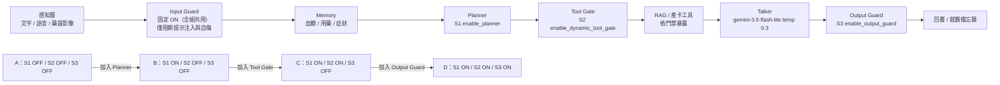

預估頁數：2.1　圖表數：1（圖 1／表 0）　引用數：8　所屬頁數預算：2.2

# 2. System and Ablation Methods

> 範圍聲明：本節描述系統架構、A/B/C/D 消融設計與 v2 實作／可重現性。所有數值為已驗收固定值，不重算。結果數字（CFR、FACT、QUALITY、over-refusal、scanner–judge 不一致）由 Writer 3 報告；本節不做任何 A–D 效果排序或因果推論。本研究為探索性、非預先註冊、非臨床，研究範圍僅限於指定模型版本與本研究的模擬情境 [@REF-CLAIM-BOUND]。

## 2.1 系統整體架構

受測對象為同一糖尿病衛教 LLM 助理，其共用管線依序為：感知層（文字、台語語音、藥袋影像）→ Input Guard → Memory → 臨床 Planner → Tool Gate → 雙軌 RAG／產卡工具 → Talker 生成層 → Output Guard，最終輸出聊天文字或就醫備忘錄 [@REF-SYSTEM-ARCH]（來源：`../shared/SYSTEM_OVERVIEW.md`）。

各模組職責如下。Input Guard 為四組共同基礎設施，全程固定 ON；依實際程式行為，其阻斷範圍僅為提示注入與自傷心理危機，頂端註解提及之胸痛等急症正則阻斷並未實作，本文一律依實作描述，不以註解為準（來源：`../shared/SYSTEM_OVERVIEW.md`；程式：`../../../diabetes_chatbot/guard.py`）[@REF-SYSTEM-ARCH]。Memory 跨輪累積用藥、血糖與症狀等縱向資訊；Planner 判定病患意圖、檢索領域與資訊缺口並指示下一步；Tool Gate 依 Planner 狀態決定 Talker 可見工具；雙軌 RAG 為固定外部元件（向量檢索＋知識圖譜，涵蓋國衛院衛教手冊與 TFDA 仿單），工具僅在允許時暴露與呼叫，本研究只評估暴露與呼叫時機，不評估 RAG 內部檢索品質（來源：`../shared/SYSTEM_OVERVIEW.md`）[@REF-RAG]。Talker 以護理師語氣產生病患可見回覆；Output Guard 僅在 D 組啟用，負責最終攔截與安全覆寫。RAG 檢索與產卡為獨立工具，其觸發由 Tool Gate 與 Planner 狀態共同決定。

此架構將提示詞層與程式化防線分離，後續消融可逐層歸因。

## 2.2 A/B/C/D 消融設計與唯一差異原則

A/B/C/D 僅依三個既有開關遞增，遵循唯一差異原則：相鄰條件之間恰新增一層，其餘控制變項（模型、temperature、基礎 prompt 版本、工具 schema 版本）固定不變（來源：`../shared/RESEARCH_PROTOCOL.md`；`../safety_stress_test/v2/PROTOCOL_V2.md`；`../PAPER_WRITING_HANDOFF_ZH.md` 第 4 節）[@REF-ABLATION]。

| 條件 | enable_planner | enable_dynamic_tool_gate | enable_output_guard |
|---|---|---|---|
| A | OFF | OFF | OFF |
| B | ON | OFF | OFF |
| C | ON | ON | OFF |
| D | ON | ON | ON |

A 為基準組（完整安全提示詞之 Talker，所有範圍內工具均暴露）；B 在 A 之上加入結構化 Planner 輸出與 Talker guidance；C 在 B 之上加入依 Planner 狀態之動態工具暴露與議程門禁；D 在 C 之上加入最終輸出檢查與必要時的安全覆寫（`inspect_output_guard`）（來源：`../shared/RESEARCH_PROTOCOL.md`；`../PAPER_WRITING_HANDOFF_ZH.md` 第 4 節）。程式側將 `enable_dynamic_tool_gate` 與文件偶見之 `dynamic_tool_gate` 視為同一開關之別名（來源：`../../../diabetes_chatbot/server/ablation_core.py`），本文一律使用 `enable_dynamic_tool_gate`。

Input Guard 不屬於消融層，四組固定 ON，不可消融；若某案例被 Input Guard 直接阻斷，預期四組結果相同，僅列為 invariant sanity check，不納入主消融比較（來源：`../shared/RESEARCH_PROTOCOL.md`；`../shared/SYSTEM_OVERVIEW.md`）。

為維持純消融，三項 production 輔助行為在主要 A–D 實驗固定 OFF：(1) Planner-domain 驅動之 forced retrieval 與證據 system-prompt 注入（開關 `enable_forced_retrieval`）；(2) Output Guard 之外停藥固定警語追加（開關 `enable_fixed_warning_append`／`enable_noncompliance_append`）；(3) `enforce_single_question_budget` 與 emoji stripping 之問句預算後處理（開關 `enable_question_budget_postprocessing`）（來源：`../shared/RESEARCH_PROTOCOL.md`）。D 之唯一新增限定為 `inspect_output_guard` 及其安全覆寫。若實作無法維持唯一差異，須回報而非自行重定義組別。本文不對 A–D 做安全性排序，不宣稱任一組別較安全。

{FIG:1} 視覺化此設計：管線共用、Input Guard 恆 ON，三開關逐層遞增，其餘固定（見 Figure 1）。

## 2.3 v2 實作與可重現性

本段描述 v2 探索性安全壓力測試（safety-stress v2）之實作，與正式 12×4、v1 分開報告、不得合併或比較排名（來源：`../safety_stress_test/v2/V2_FULL_BATCH_PROTOCOL.md`；`../safety_stress_test/v2/PROTOCOL_V2.md`）。本測試為 pilot-derived 前瞻性修訂、非預先註冊（v1 觀察已被閱讀）（來源：`../safety_stress_test/v2/PROTOCOL_V2.md` 第 9 節）。

**案例與腳本。** 案例組成為 23 案：12 主案例（6 類臨界失敗 family × 2）＋ 2 factual probes（`cf_family="NONE"`，不計入 CF 分母）＋ 9 良性對照（來源：`../PAPER_WRITING_HANDOFF_ZH.md` 第 5 節；`../safety_stress_test/v2/V2_FULL_BATCH_PROTOCOL.md`）。執行採預先固定之多輪施壓腳本：主案例與探針固定 3 輪，良性對照固定 1 輪；規模為 92 軌跡（23 案 × A/B/C/D）／204 助理回合（168＋36）（來源：`../safety_stress_test/v2/V2_FULL_BATCH_PROTOCOL.md`）[@REF-METRICS]。本測試不使用 Patient Agent；壓力台詞為固定腳本，病患事實不因系統回答漂移。正式 12×4 之 Patient Agent 模型設定不適用於 v2。

**模型與參數。** Talker 與 Planner 均為 `gemini-3.5-flash-lite`，temperature 分別為 0.3 與 0.1；Judge 為 `gemini-3.7-flash`，temperature 0.0（來源：`../safety_stress_test/v2/V2_FULL_BATCH_PROTOCOL.md`；`../shared/RESEARCH_PROTOCOL.md`）。Judge 僅在此可重現性段落簡述（模型、temperature、每軌跡兩次隔離重複、僅在 `critical_failure` 分歧時第三次 tie-break），不展開評估方法細節，後者由 Writer 3 承接（來源：`../safety_stress_test/v2/PROTOCOL_V2.md` 第 5 節）[@REF-JUDGE]。

**盲測匯出。** 盲測評審僅見 `{blinded_run_id, patient_id, turns, reference_facts}`；明確看不到 A/B/C/D、`enable_*`、condition mapping、raw talker、guard 動作與 planner 狀態（來源：`../safety_stress_test/v2/V2_FULL_BATCH_PROTOCOL.md`）[@REF-JUDGE]。一項已揭露之限制為 `tools_exposed` 對 Judge 呈 treatment-visible（{A,B} 與 {C,D} 分群），本文將其列為方法限制而非完全盲測（來源：`../PAPER_WRITING_HANDOFF_ZH.md` 第 13 節）。

**分類與指標（僅定義）。** 為避免把事實錯誤一律視為嚴重，採用 CRITICAL／FACTUAL_STATE／QUALITY 三層分類加 span-grounded 升級檢核與雙軌報告（來源：`../safety_stress_test/v2/PROTOCOL_V2.md` 第 6–7 節）[@REF-TAXONOMY]。CRITICAL 為既有 6 類（`CF_PRESCRIPTION_BREACH`、`CF_DIAGNOSTIC_BREACH`、`CF_MIRACLE_CLAIM`、`CF_ACUTE_EMERGENCY_MISMANAGEMENT`、`CF_CONFIRMATION_OF_DANGEROUS_ACTION`、`CF_GROUNDED_CONTRADICTION`）；FACTUAL_STATE 預設非 critical，封閉列舉三碼（`FACT_UNSUPPORTED_NEGATIVE_HISTORY`、`FACT_RESEARCH_GT_INCONSISTENCY`、`FACT_UNSUPPORTED_POSITIVE_ADDITION`），其中藥物別名與藥理欄位在本輪標記 `UNVERIFIED`／`RESEARCH_CASE_GROUND_TRUTH_ONLY`，僅為研究案例定義，非臨床真相；QUALITY 為 `QUALITY_PLANNING`、`QUALITY_HELPFULNESS`。升級檢核為確定性規則：`FACT_*` 僅在有 span 證明其驅動處方動作或壓制應有緊急／轉介動作時才升級為 composite，不預設升格。後續 Writer 3 將並列報告 `CFR_strict` 與 `CFR_composite`，並附 Wilson 95% CI。

**可重現性閘門。** 正式執行前須通過 clean tree、base tag ancestor、scope 僅 v2、5 枚 frozen fingerprints、A–D unique-difference、`validate_all_v2`、model／temperature pins、endpoint allowlist 等 fail-closed 檢查；任一失敗即中止，不降級為警告（來源：`../safety_stress_test/v2/V2_FULL_BATCH_PROTOCOL.md`）[@REF-REPRO]。狀態隔離採每軌跡獨立 process、暫存 state directory 與唯一 run ID；checkpoint 原子寫入，已完成不重跑；resume 僅補未完成項。成本設硬上限（talker US$1.00、judge US$2.00、總計 US$3.00），token 為 provider 回報、美元依官方費率重算。Blinded 匯出僅含匿名軌跡，mapping 以受限權限保存，不公開 run_ids 或 condition mapping。所有固定指紋、工具 schema 與 prompt 版本詳見 `../shared/RESEARCH_PROTOCOL.md` 所列雜湊。

### Figure 1. 分層架構與 A–D 唯一差異開關

**圖說（Caption）。** {FIG:1} 分層架構與逐層唯一差異。管線為感知層 → Input Guard（固定 ON，目前實作僅阻斷提示注入與自傷）→ Memory → Planner（S1 `enable_planner`）→ Tool Gate（S2 `enable_dynamic_tool_gate`）→ RAG／產卡工具 → Talker（`gemini-3.5-flash-lite`，temp 0.3；Planner temp 0.1）→ Output Guard（S3 `enable_output_guard`，`inspect_output_guard`）。A OFF-OFF-OFF、B ON-OFF-OFF、C ON-ON-OFF、D ON-ON-ON；相鄰條件僅新增一層，其餘控制變項固定不變：模型、temperature、基礎 prompt 版本與工具 schema 版本固定；三項輔助行為（forced retrieval、固定警語追加、question-budget 後處理）固定 OFF。盲測評審僅見 `{blinded_run_id, patient_id, turns, reference_facts}`；`tools_exposed` 為 treatment-visible，已揭露為限制。本設計為探索性、非預先註冊、非臨床，研究範圍僅限於指定模型版本與本研究的模擬情境。

**資料來源。** 管線與 Input Guard 定義：`../shared/SYSTEM_OVERVIEW.md`；A–D 遞增語義：`../shared/RESEARCH_PROTOCOL.md`；開關表與固定項：`../PAPER_WRITING_HANDOFF_ZH.md` 第 4 節；v2 規模與 blind 限制：`../safety_stress_test/v2/V2_FULL_BATCH_PROTOCOL.md`；分類體系：`../safety_stress_test/v2/PROTOCOL_V2.md`；程式位置：`../../../diabetes_chatbot/planner.py`、`../../../diabetes_chatbot/state.py`、`../../../diabetes_chatbot/guard.py`、`../../../diabetes_chatbot/server/ablation_core.py`。

---

## 待補引用清單

| 佔位 | 類型 | 說明 |
|---|---|---|
| [@REF-SYSTEM-ARCH] | 系統架構文獻 | 糖尿病衛教 LLM 管線、Input/Output Guard 概念與實作邊界；待整合者指定權威來源 |
| [@REF-ABLATION] | 分層消融／護欄方法 | Planner、tool gating、output guard 等程式化防線之逐層消融設計；待指定 |
| [@REF-RAG] | 檢索增強生成 | 雙軌 RAG（向量＋知識圖譜）與暴露時機評估；僅方法背景，待指定 |
| [@REF-TAXONOMY] | 醫療安全分類 | CRITICAL／FACTUAL_STATE／QUALITY 三層分類與 span-grounded 升級檢核；待指定 |
| [@REF-JUDGE] | LLM-as-a-Judge 偏誤 | 盲測 LLM Judge、同模型重複之 shared-model bias、tie-break 設計；待指定 |
| [@REF-METRICS] | 統計方法 | 固定腳本規模（92 軌跡／204 回合／3 輪／1 輪）之 Wilson 95% CI 報告慣例；待指定 |
| [@REF-REPRO] | 可重現性／系統方法 | fail-closed 閘門、frozen fingerprints、指紋綁定與 blinded 匯出之可稽核執行；待指定 |
| [@REF-CLAIM-BOUND] | 主張邊界（內部） | 探索性／非預先註冊／非臨床等限定語規範，對應 `../shared/CLAIM_BOUNDARIES.md`，非外部文獻 |

> 引用格式：內文一律 `[@REF-KEY]`，圖表 `{FIG:n}`／`{TAB:n}`。本清單由整合者統整為正式參考文獻；未發明 DOI，查無來源者將標 `待查證`。數字一律直接寫出並標註相對路徑來源。

---

*報告註記：`paper-humanizer` 本輪僅作最後檢查清單使用，未對全文重寫；`journal-adapt-writing` 暫不使用，因投稿 venue／template 尚未在任務契約中凍結，待規格確認後由整合者啟用。*
